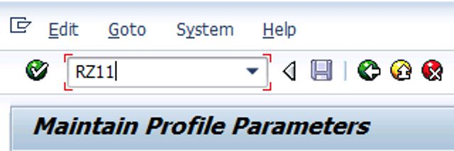
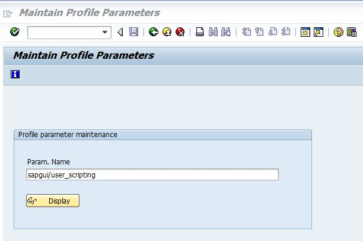
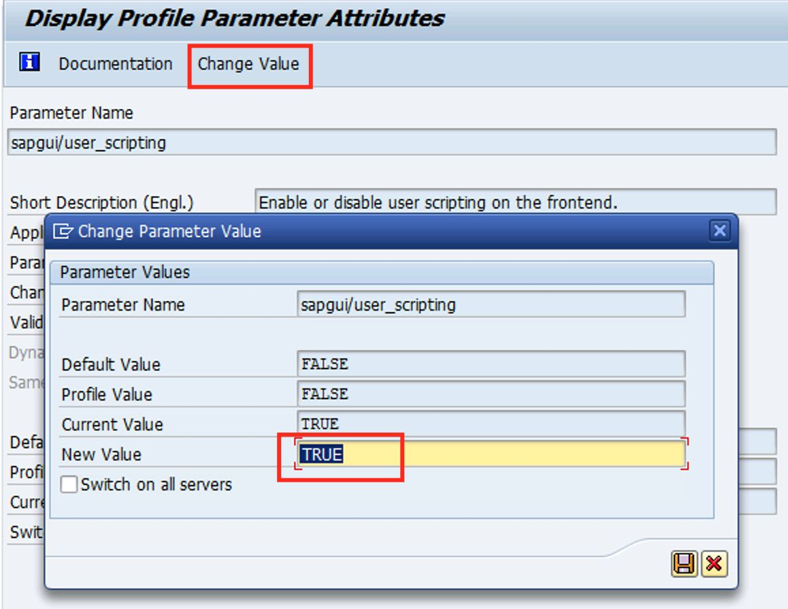
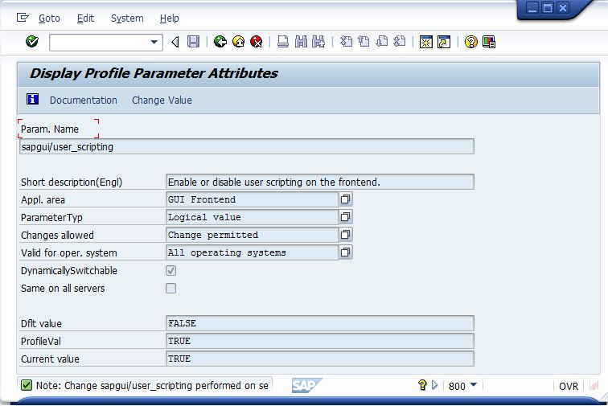
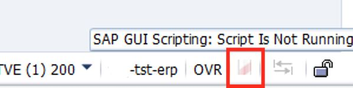
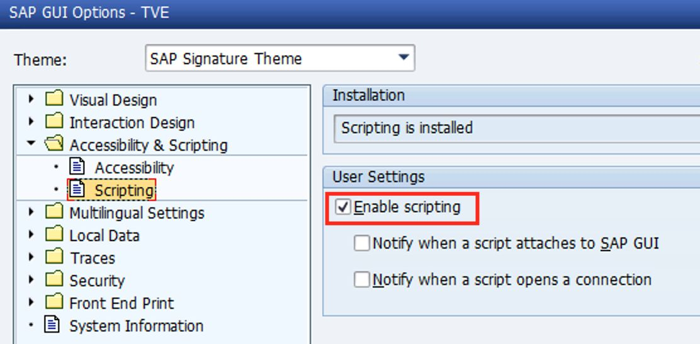
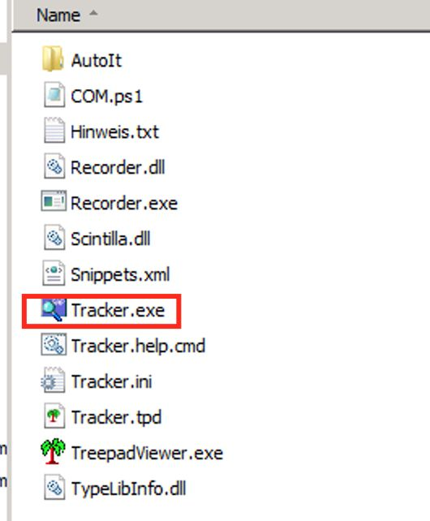
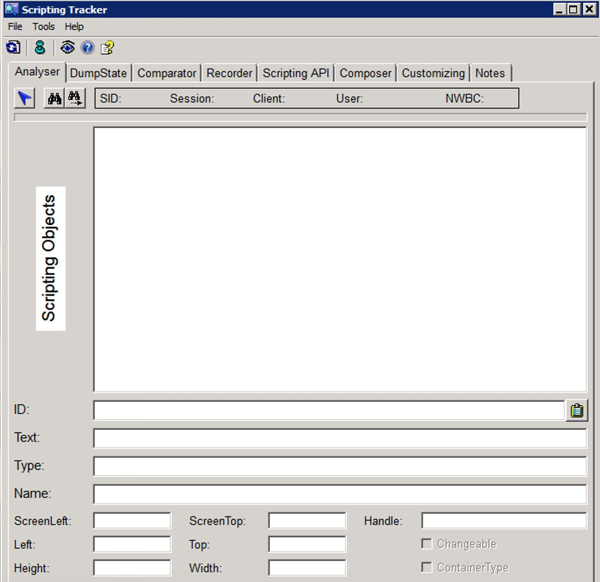
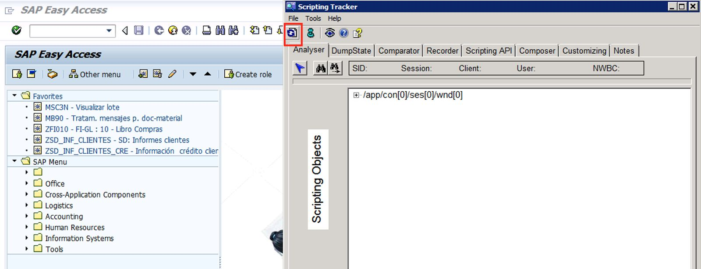
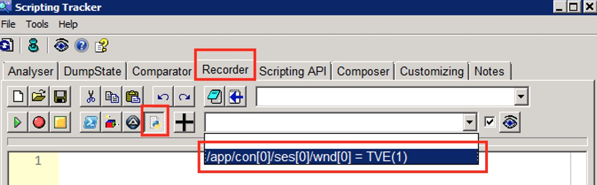

# SAP
  
Com este módulo você pode automatizar SAP R3 e Hana. Execute todas as ações que você pode gravar com o rastreador criado por Stefan Schnell.  

*Read this in other languages: [English](Manual_SAPObjetos.md), [Português](Manual_SAPObjetos.pr.md), [Español](Manual_SAPObjetos.es.md)*
  

## Como instalar este módulo
  
Para instalar o módulo no Rocketbot Studio, pode ser feito de duas formas:
1. Manual: __Baixe__ o arquivo .zip e descompacte-o na pasta módulos. O nome da pasta deve ser o mesmo do módulo e dentro dela devem ter os seguintes arquivos e pastas: \__init__.py, package.json, docs, example e libs. Se você tiver o aplicativo aberto, atualize seu navegador para poder usar o novo módulo.
2. Automático: Ao entrar no Rocketbot Studio na margem direita você encontrará a seção **Addons**, selecione **Install Mods**, procure o módulo desejado e aperte instalar.  

## Cómo usar este módulo
Para usar este módulo, você precisa se conectar à sua conta SAP.

Primeiro você deve ativar os scripts no SAP GUI.

No SAP GUI, você deve ir para a transação RZ11; no nome do parâmetro, digite "sapgui/user_scripting" e clique em Exibir (display).

Clique em “Alterar valor” e em “Novo valor” selecione "TRUE". Salve isso.

A imagem a seguir indica que o GUI Scripting está habilitado no RZ11.

Em “Acessibilidade e scripting”, vá para “Scripting” e ative a opção “Ativar scripts”. Salve isso.

Como funcionar corretamente?

Abrir Tracker.exe

Irá abrir uma janela como esta.

Abra o SAP e faça login. Uma vez logado, clique no ícone e sincronizará a sessão SAP ativa.

Vá em "Recorder" e clique no ícone Python.

# Timeout

Configure
 os tempos limite no arquivo config.ini localizado na pasta do módulo. O usuário pode configurar o timeout para abertura do SAP e o timeout global para ser utilizado na execução dos comandos.

## Descrição do comando

### LoginSap
  
Abre o aplicativo SAP, estabeleça a conexão e faz login
|Parâmetros|Descrição|exemplo|
| --- | --- | --- |
|Rota SAP|Caminho do aplicativo SAP|C:/Program Files (x86)/SAP/FrontEnd/SAPgui/saplogon.exe|
|Nome do conexão|Nome da conexão onde você deseja fazer o login|Desarrollo (Directo)|
|ID Usuario|O ID do campo usuario|wnd[0]/usr/txtRSYST-BNAME|
|Nome do usuário|Nome do usuário que você digita no campo usuário para fazer o login|Usuario1|
|ID de senha|O ID do campo senha|wnd[0]/usr/pwdRSYST-BCODE|
|Senha|Senha que você digita no campo senha para fazer o login|S3nh4 123|
|Synchronous mode|Connect synchronously|Checkbox|
|Timeout|Tempo decorrido (em segundos) para procurar o elemento|10|
|Asynchronous mode|Connect asynchronously|Checkbox|
|Salvar resultado da conexão|Variável onde o resultado da conexão será salvo|variável|

### Conectar
  
Conecte-se a um aplicativo SAP aberto
|Parâmetros|Descrição|exemplo|
| --- | --- | --- |
|Nome do conexão|Nome da conexão onde você deseja fazer o login|Desarrollo (Directo)|
|Salvar resultado da conexão|Variável onde o resultado da conexão será salvo|variável|

### Executar uma ação
  
Execute uma ação no SAP como selecionar, focar ou modificar o texto de um elemento através de diferentes propriedades (setFocus, text, etc.)
|Parâmetros|Descrição|exemplo|
| --- | --- | --- |
|ID do objeto|Identificador obtido no tracker|wnd[0]/tbar[0]/okcd|
|Row number (Optional)|Número da linha onde você deseja executar a ação. No tracker aparecerá como selectedRows|0|
|Column name or number (Optional)|Nome o numero da coluna onde você deseja executar a ação. No tracker aparecerá como currentCellColumn o columns.elementAt|TYPE_DOC|
|valor|Valor mostrado no tracker após um igual (=) (Ej. id.atributo = valor), ou como entre parêntesis (Ex. id.atributo(valor)|QMNUM|
|Opção|Propiedade indicada no tracker depóis findById('algun id'). Ex session.findById('wnd[0]/tbar[0]/okcd').propiedade|Opção|
|Timeout|Tempo decorrido (em segundos) para procurar o elemento|10|
|Asynchronous mode|Click asynchronously|Checkbox|

### Extrair Texto
  
Extrair o texto de um objeto no SAP, usando a propriedade text
|Parâmetros|Descrição|exemplo|
| --- | --- | --- |
|ID do objeto|Identificador obtido no tracker|wnd[0]/tbar[0]/okcd|
|Opções|Opções para extrair o texto||
|Valor|Valor mostrado no tracker após um igual (=) (Ej. id.atributo = valor), ou como entre parêntesis (Ex. id.atributo(valor)|QMNUM|
|Título|Opção de obter o título junto com o texto em forma de dicionário||
|Timeout|Tempo decorrido (em segundos) para procurar o elemento|10|
|Atribuir à variável|Nome do variável onde o resultado vai ser salvado|variável|

### Extraia o texto de ajuda
  
Extraia o texto de um objeto no SAP da caixa de ajuda
|Parâmetros|Descrição|exemplo|
| --- | --- | --- |
|ID do objeto|Identificador obtido no tracker|wnd[0]/tbar[0]/okcd|
|Timeout|Tempo decorrido (em segundos) para procurar o elemento|10|
|Atribuir à variável|Nome do variável onde o resultado vai ser salvado|variável|

### Marque / desmarque
  
Marque ou desmarque um objeto no SAP
|Parâmetros|Descrição|exemplo|
| --- | --- | --- |
|opção|Selecione marcar ou desmarcar|Uncheck|
|Check individually with absoluteRow|Option to check them with absolute row|Checkbox|
|Check all|Option to check them all|Checkbox|
|Absolute Row|Column to interact with|3|
|ID do objeto|Identificador obtido no tracker|wnd[0]/tbar[0]/okcd|
|Timeout|Tempo decorrido (em segundos) para procurar o elemento|10|

### Extrair célula
  
Extraia o texto em uma célula, pode ser com GetItemText ou GetCellValue
|Parâmetros|Descrição|exemplo|
| --- | --- | --- |
|ID do Objecto|Identificador obtido no tracker|wnd[0]/tbar[0]/okcd|
|Número da linha|Número da linha onde você deseja extrair o texto. No tracker aparecerá como selectedRows|0|
|Nome da coluna|Nome da coluna onde você deseja extrair o texto. No tracker aparecerá como currentCellColumn|TYPE_DOC|
|Opção||Opção|
|Timeout|Tempo decorrido (em segundos) para procurar o elemento|10|
|Assign to Variable|Nome do variável onde o resultado vai ser salvado|variável|

### Clique em célula
  
Clique em uma célula. Pode ser com clickCurrentCell, setCurrentCell ou doubleClickCurrentCell
|Parâmetros|Descrição|exemplo|
| --- | --- | --- |
|Object ID|Identificador obtido no tracker|wnd[0]/tbar[0]/okcd|
|Row number|Número da linha onde você deseja extrair o texto. No tracker aparecerá como selectedRows|0|
|Column name|Nome da coluna onde você deseja extrair o texto. No tracker aparecerá como currentCellColumn|TYPE_DOC|
|Click type|Propiedade indicada no tracker depóis findById('algun id'). Ex session.findById('wnd[0]/tbar[0]/okcd').propiedade|Opção|
|Timeout|Tempo decorrido (em segundos) para procurar o elemento|10|

### Execute Script
  
Execute um gravador de script VBS com SAP
|Parâmetros|Descrição|exemplo|
| --- | --- | --- |
|Path VBA Script|Caminho do arquivo VBS|C:/path/to/script.vbs|
|Default Script||Opção|

### 
  

|Parâmetros|Descrição|exemplo|
| --- | --- | --- |
|ID do Objeto|Identificador obtido no tracker|wnd[0]/tbar[0]/okcd|
|Timeout|Tempo decorrido (em segundos) para procurar o elemento|10|
|Atribuir à variável|Nome do variável onde o resultado vai ser salvado|variável|

### Envio de tecla
  
Replica evento de envio de tecla
|Parâmetros|Descrição|exemplo|
| --- | --- | --- |
|ID Objeto|Identificador obtido no tracker|wnd[0]/tbar[0]/okcd|
|Row number (Optional)|Número da linha onde você deseja enviar a chave. No tracker aparecerá como selectedRows|0|
|Column name (Optional)|Nome da coluna onde você deseja enviar a chave. No tracker aparecerá como currentCellColumn|TYPE_DOC|
|tecla|Tecla ou combinação a ser enviada|F1|
|Timeout|Tempo decorrido (em segundos) para procurar o elemento|10|

### Obter propriedade
  
Obtém uma propriedade do objeto SAP especificado
|Parâmetros|Descrição|exemplo|
| --- | --- | --- |
|ID do objeto|Identificador obtido no tracker|wnd[0]/tbar[0]/okcd|
|Valor|Valor mostrado no tracker após um igual (=) (Ej. id.atributo = valor), ou como entre parêntesis (Ex. id.atributo(valor)|QMNUM|
|Propiedade|Propriedade para obter. Para ver todas as propiedades, ir á https//help.sap.com/viewer/b47d018c3b9b45e897faf66a6c0885a8/760.03/en-US/a2e9357389334dc89eecc1fb13999ee3.html|Opção|
|Timeout|Tempo decorrido (em segundos) para procurar o elemento|10|
|Atribuir à variável|Nome do variável onde o resultado vai ser salvado|variável|

### Esperar objeto
  
Espera a que um objeto seja visível
|Parâmetros|Descrição|exemplo|
| --- | --- | --- |
|ID do objeto|Identificador obtido no tracker|wnd[0]/tbar[0]/okcd|
|Timeout|Tempo decorrido (em segundos) para procurar o elemento|10|
|Atribuir à variável|Nome do variável onde o resultado vai ser salvado|variável|

### Exportar arquivo
  
Exportar um arquivo do SAP
|Parâmetros|Descrição|exemplo|
| --- | --- | --- |
|ID do caminho da pasta|Identificador obtido no tracker|wnd[1]/usr/ctxtDY_PATH|
|Caminho da pasta|Identificador obtido no tracker|C:\users\user\documents|
|ID do nome do arquivo|Identificador obtido no tracker|wnd[1]/usr/ctxtDY_FILENAME|
|Nome do arquivo|Identificador obtido no tracker|file.txt|
|ID do botão|Identificador obtido no tracker|wnd[1]/tbar[0]/btn[11]|
|Timeout|Tempo decorrido (em segundos) para procurar o elemento|10|
